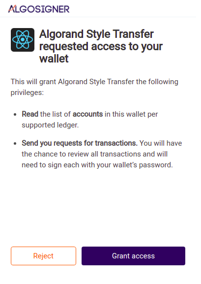
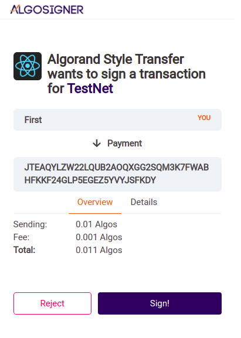
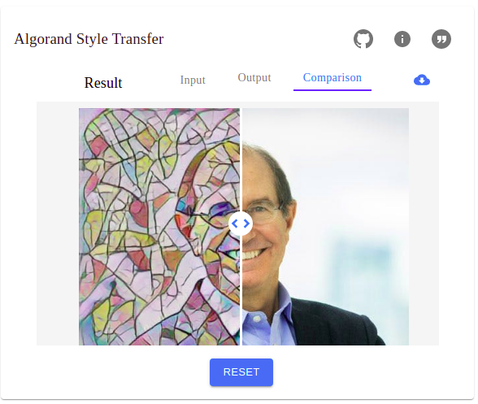

# AI Services on Algorand: Style Transfer


## Overview

This solution shows how would be possible to use Algorand as the payment gateway for an 
Artificial Intelligence Marketplace.

Our first integrated AI Service is an online Style Transfer, which users can create amazing images from 
any photo. How cool would it be to have a profile picture like a Van Gogh, Picasso or Beeple (?!) painting?

For now on you will be able to keep the same "base" profile photo on each social media, but with 
different styles!


## What is Style Transfer?

It is an AI technique that uses a model with two images as its inputs, (`Input` and `Style`),
the model then "merges" both in a single output image, transferring the `Style` image to the `Input` one.

For example:

- Input:


- Style:


- Result:


## Setup

- NodeJS v10+: https://nodejs.org/en/
- NPM v6+: https://www.npmjs.com/get-npm
- Yarn v1.22+: https://classic.yarnpkg.com/en/docs/install

```shell script
git clone https://github.com/03303/algo-style-transfer-dapp.git
cd algo-style-transfer-dapp
export REACT_APP_SERVICES_ENDPOINT=http://localhost:7000
export REACT_APP_JWT_SECRET=SUPERsecret
yarn install
yarn start
```

Great, now your frontend is good to go.

Let's set up the backend now:
```shell script
git clone https://github.com/03303/algo-style-transfer.git
cd algo-style-transfer
docker build . -t tensorflow_flask
docker run -p 7000:7000 -dti tensorflow_flask
```

Now your solution is ready!

The frontend will run at `http://localhost:3000` and the backend
at `http://localhost:7000`.


## PureStake AlgoSigner:

In order to call the service and get amazing stylized images, you will need to install
the PureStake AlgoSigner Extension/Add-On in your browser:

Please refer to the installation steps here:
- https://www.purestake.com/technology/algosigner/


## Code Base:

In order to create a fast prototype (PoC) for our idea, we built this solution using the 
Facebook's `create-react-app` ([link](https://github.com/facebook/create-react-app)).

The relevant codes:
```
algo-style-transfer-dapp/
  src/
    AlgoSignet/
      index.js
    components/
      Uploader/
        HoverIcon.js
        index.js
        SNETImageUpload.js
    helpers/
      interface.js
```

- `AlgoSignet/index.js` has all the necessary functions to interact with the AlgoSigner Extension:
  - `AlgoSignerConnect()` returns `true` if the user grants access to our website.
  - `AlgoSignerAccounts()` returns a mapping with user's Algorand `accounts`.
  - `AlgoSignerGetTxParams()` returns transaction parameters from network to help on building new transactions.
  - `AlgoSignerSign()` returns a signed transaction by user `signedTx`.
  - `AlgoSignerSendTx()` returns a transaction that was sent to the network `sentTx`.
  - `AlgoSignerCheckTx()` returns the status (`txStatus`) of a given transaction.

- `components/Uploader/` is the main component of our solution, it uses:
  - `HoverIcon.js` that has a fancy set of icons that we use to point to the service's references 
  (Github's Repository and TensorFlow Tutorials).
  - `SNETImageUpload.js` is an amazing image handler to upload / point to an URL / select from gallery images 
  to be processed by Style Transfer.
  - `index.js` is the view of the component, it wraps both previous components into one.

- `helpers/interface.js` has a helper function to fetch the response from backend (via HTTP POST method, using `axios`):
  - `GetStyleTransferResponse()` returns the output (stylized image) at `result` that is then rendered back in our frontend.
 

## Users Guide:

- Access the website (default: `http://localhost:3000`), when prompted to grant access to AlgoSigner, authorize it.
- All the Payments are in the Algorand's Testnet, so no need to spend real money here (not even in our live demo!).
- Now select an image as the `Input` (from computer of URL) and another one as the `Style`
(from computer, URL or also our Gallery).
- Now click on `Run` button to call the service's backend.
- Sign the Algorand Payment Transaction and wait for the service's response (~20s).
- You can now Compare and also download the stylized image!


## High-level Payment Workflow:

- When accessing the website for the first time, users will be prompted by the AlgoSigner pop-up to "Grant access" to our solution.



- The above pop-up will be invoked by `setup()` [function](https://github.com/03303/algo-style-transfer-dapp/blob/main/src/components/Uploader/index.js#L133).
- The `setup()` calls 2 AlgoSigner functions: `AlgoSignerConnect()` and `AlgoSignerAccounts()`
- For now on, our solution has access to the users accounts and is allowed to send him/her requests for transactions.
- After selecting the 2 input images, `Input` and `Style`, the `Run` button will be available to click.
- Then another AlgoSigner pop-up will show, asking for user to sign the Algorand Payment Transaction:

- Once user clicks on `Run`, the frontend will perform the following logic at `runService()` [function](https://github.com/03303/algo-style-transfer-dapp/blob/main/src/components/Uploader/index.js#L145):

- Populates some of the Payment Transaction parameters:
```
        const params = {
          from: accounts[0]['address'],
          to: STYLE_TRANSFER_ACCOUNT,
          amount: STYLE_TRANSFER_PRICE,
          note: STYLE_TRANSFER_NOTE
        };
```
- Calls the `AlgoSignerSign()` that populates the remaining parameters by calling `AlgoSignerGetTxParams()` and then
- With all the parameters it then calls `AlgoSigner.sign()` that will show a new pop-up:



- Once user clicks on "Sign!", our solution will send the signed transaction to the Algorand Testnet using `AlgoSignerSendTx()`.
- The solution then waits for the transaction to be processed with `AlgoSignerCheckTx()`.
- If everything went well, the solution calls `GetStyleTransferResponse()` to send both images to the backend and receive as a response the stylized images!
- User is now able to compare the stylized image with the `Input` one and also download it.




## Live Demo (Algorand Testnet):

- https://algorand.nonsense.codes/


## Next Steps:

- Add QR Codes for users that do not have AlgoSigner installed.
- Integrate more AI Services (Object Detection, Speech-To-Text, Text-To-Speech, Sentiment Analysis, etc).


## References:

This repo was heavily based on:

- [SingularityNET Style Transfer dApp Frontend](https://github.com/singnet/snet-dapp/tree/master/src/assets/thirdPartyServices/snet/style_transfer)
- [Tensorflow's Neural style transfer](https://www.tensorflow.org/tutorials/generative/style_transfer)
